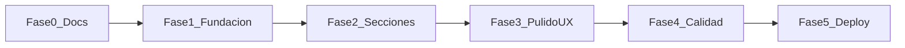

# PHASES — Plan de implementación

Checklist técnico por fases para construir el portfolio. Marcar cada ítem con `[x]` al completarlo.

**Orden:** completar cada fase antes de pasar a la siguiente.  
**Referencia:** ver [PRD.md](PRD.md) para requisitos de producto y [RULES.md](RULES.md) para convenciones de código.

---

## Fase 0 — Documentación

> Definir qué construir y cómo mantenerlo.

- [x] Crear `RULES.md` con convenciones de código y estructura
- [x] Crear `PRD.md` con requisitos de producto por sección
- [x] Crear `PHASES.md` con este plan de implementación

**Criterio de listo:** Los tres archivos existen y están alineados con el plan aprobado.

---

## Fase 1 — Fundación

> Scaffold del proyecto, dependencias, design tokens y layout base.

### 1.1 Inicialización del proyecto

- [x] Crear proyecto Next.js 15 con TypeScript, Tailwind, ESLint y App Router
  ```bash
  npx create-next-app@latest . --typescript --tailwind --eslint --app --src-dir=false --import-alias="@/*"
  ```
- [x] Verificar que `npm run dev` arranca sin errores
- [x] Inicializar git y crear `.gitignore` (si no viene incluido)

### 1.2 Dependencias

- [x] Instalar y configurar shadcn/ui
  ```bash
  npx shadcn@latest init
  ```
- [x] Agregar componentes base: `button`, `card`, `badge`
  ```bash
  npx shadcn@latest add button card badge
  ```
- [x] Instalar Framer Motion: `npm install framer-motion`
- [x] Instalar next-intl: `npm install next-intl`
- [x] Instalar next-themes: `npm install next-themes`

### 1.3 Design tokens (globals.css)

- [x] Definir variables CSS para modo claro (background, foreground, accent, secondary)
- [x] Definir variables CSS para modo oscuro (misma estructura, valores ajustados)
- [x] Configurar tipografías: Fraunces (display) + DM Sans (body) vía `next/font`
- [x] Agregar `transition-colors duration-300` en `body`
- [x] Configurar `prefers-reduced-motion` para desactivar animaciones

### 1.4 Internacionalización

- [x] Crear `i18n.ts` con `locales: ["es", "en"]` y `defaultLocale: "es"`
- [x] Crear `middleware.ts` para redirigir `/` → `/es`
- [x] Crear estructura `app/[locale]/layout.tsx` y `app/[locale]/page.tsx`
- [x] Crear `messages/es.json` y `messages/en.json` con keys iniciales de nav
- [x] Verificar que `/es` y `/en` cargan correctamente

### 1.5 Tema claro / oscuro

- [x] Crear `components/providers/ThemeProvider.tsx` con next-themes
- [x] Envolver layout con ThemeProvider
- [x] Crear `components/layout/ThemeToggle.tsx` (icono sol/luna)
- [x] Verificar persistencia en localStorage y respeto a `prefers-color-scheme`

### 1.6 Layout base

- [x] Crear `components/layout/Header.tsx`
  - [x] Logo / nombre con link a Hero
  - [x] Nav con anclas a secciones (scroll suave)
  - [x] `LanguageToggle.tsx` (ES / EN)
  - [x] `ThemeToggle.tsx`
  - [x] Versión mobile (menú hamburguesa o nav compacto)
- [x] Crear `components/layout/Footer.tsx`
  - [x] Copyright con año dinámico
  - [x] Links a redes sociales
- [x] Integrar Header y Footer en `app/[locale]/layout.tsx`
- [x] Verificar header fijo al scroll en ambos temas

**Criterio de listo:** Proyecto corre en local, `/es` y `/en` funcionan, toggles de idioma y tema operativos, layout base visible.

---

## Fase 2 — Datos y secciones

> Contenido placeholder y componentes de cada sección.

### 2.1 Archivos de datos

- [x] Crear `data/profile.ts` con tipos y contenido placeholder (es/en)
- [x] Crear `data/projects.ts` con mínimo 3 proyectos placeholder
- [x] Crear `data/skills.ts` con 3 categorías
- [x] Crear `data/experience.ts` con 2 entradas
- [x] Crear `data/education.ts` con 1 entrada
- [x] Exportar tipos: `LocalizedString`, `Project`, `Experience`, etc.
- [x] Completar `messages/es.json` y `messages/en.json` con todos los textos de UI

### 2.2 Assets placeholder

- [x] Crear `public/images/` con placeholders de proyectos
- [x] Agregar `public/cv.pdf` placeholder
- [x] Agregar foto de perfil placeholder en `public/images/`

### 2.3 Secciones (una por una)

Implementar en `components/sections/`. Cada sección debe cumplir criterios del PRD.

- [x] **Hero.tsx**
  - [x] h1, título, tagline desde data
  - [x] Foto con forma orgánica
  - [x] 3 CTAs: proyectos, CV, contacto
- [x] **About.tsx**
  - [x] Bio y disponibilidad desde data
  - [x] Layout responsive 1–2 columnas
- [x] **Projects.tsx**
  - [x] Grid de cards desde data/projects.ts
  - [x] Imagen, título, descripción, badges, links
  - [x] Hover sutil
- [x] **Skills.tsx**
  - [x] Categorías con badges
  - [x] Títulos traducidos
- [x] **Experience.tsx**
  - [x] Timeline vertical
  - [x] Rol, empresa, período, highlights
- [x] **Education.tsx**
  - [x] Cards o timeline
  - [x] Institución, título, período
- [x] **Contact.tsx**
  - [x] Email con botón copiar
  - [x] Links GitHub y LinkedIn
  - [x] Formulario visual (o mailto)
  - [x] Botón descargar CV

### 2.4 Integración en página

- [x] Importar todas las secciones en `app/[locale]/page.tsx`
- [x] IDs de ancla en cada sección (`id="about"`, etc.)
- [x] Scroll suave entre secciones (`scroll-behavior: smooth`)
- [x] Verificar orden: Hero → About → Projects → Skills → Experience → Education → Contact

**Criterio de listo:** Todas las secciones visibles con contenido placeholder, navegación por anclas funciona, contenido cambia al switch de idioma.

---

## Fase 3 — i18n, tema y responsive

> Pulir experiencia multilingüe, temas y diseño adaptable.

### 3.1 Internacionalización completa

- [x] Auditar que ningún texto visible esté hardcodeado en JSX
- [x] Verificar traducción de todas las secciones en `/en`
- [x] Verificar que no hay mezcla ES/EN en ninguna vista
- [x] Persistencia de idioma al recargar página

### 3.2 Temas completos

- [x] Auditar cada sección en modo claro
- [x] Auditar cada sección en modo oscuro
- [x] Corregir contrastes que fallen WCAG AA
- [x] Verificar transición suave al cambiar tema

### 3.3 Responsive

- [x] Probar en 320px (móvil pequeño)
- [x] Probar en 768px (tablet)
- [x] Probar en 1280px+ (desktop)
- [x] Header/nav usable en móvil
- [x] Grids de proyectos y skills adaptan columnas
- [x] Sin scroll horizontal en ningún breakpoint

### 3.4 Animaciones

- [x] Animación de entrada por sección con Framer Motion (fade + slide sutil)
- [x] Hover en cards de proyectos
- [x] Respetar `prefers-reduced-motion`
- [x] Sin animaciones excesivas ni que bloqueen interacción

**Criterio de listo:** Sitio usable y bonito en móvil/desktop, ambos idiomas y temas sin bugs visuales.

---

## Fase 4 — Pulido y entrega

> SEO, accesibilidad, build de producción y documentación de uso.

### 4.1 SEO

- [x] Metadata por idioma en layout (`title`, `description`)
- [x] Open Graph tags (imagen, título, descripción)
- [x] Favicon en `public/`
- [x] Un solo h1 (en Hero)
- [x] Jerarquía de headings correcta

### 4.2 Accesibilidad

- [x] `alt` en todas las imágenes
- [x] `aria-label` en iconos sin texto
- [x] Focus visible en elementos interactivos
- [x] Navegación por teclado funcional
- [x] Landmarks semánticos (`header`, `main`, `section`, `footer`)

### 4.3 Calidad de código

- [x] `npm run build` pasa sin errores
- [x] `npm run lint` sin warnings críticos
- [x] Revisar que se cumplen todas las reglas de [RULES.md](RULES.md)

### 4.4 README

- [x] Crear `README.md` con:
  - [x] Descripción del proyecto
  - [x] Cómo instalar y correr (`npm install`, `npm run dev`)
  - [x] Cómo editar contenido (`data/`, `messages/`)
  - [x] Cómo agregar un proyecto nuevo (3 pasos)
  - [x] Stack tecnológico

**Criterio de listo:** Build de producción exitoso, README claro, checklist de RULES cumplido.

**Estado:** Portfolio local **terminado** (fases 0–4). Placeholders listos para reemplazar en `data/` (PRD §6). Deploy pendiente (fase 5).

---

## Fase 5 — Deploy (opcional, cuando quieras)

> Publicar el portfolio en internet.

- [ ] Crear repositorio en GitHub
- [ ] Push del código *(commit listo en `main`; falta `git remote` + push)*
- [ ] Conectar repo con Vercel
- [ ] Verificar deploy en URL de preview
- [ ] Configurar dominio personal (opcional)
- [ ] Probar sitio en producción: idiomas, temas, links, CV

**Preparado localmente:** `.env.example`, guía de deploy en `README.md`, build verificado.

**Criterio de listo:** Portfolio accesible públicamente en una URL.

---

## Resumen de dependencias entre fases



---

## Notas para el desarrollador

- **Antes de cada sesión de trabajo:** leer la fase actual y marcar progreso.
- **Al terminar una sección:** verificar checklist de RULES (tema, idioma, responsive).
- **Si algo no está claro:** consultar PRD para requisitos, RULES para convenciones.
- **Contenido real:** reemplazar placeholders en `data/` cuando el autor provea sus datos (ver sección 6 del PRD).
